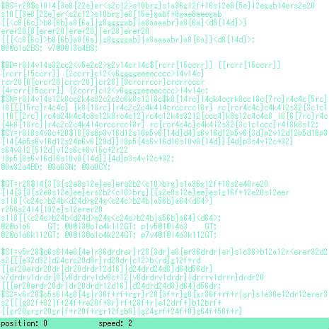

# [TinySiOPM MML workbench](http://wonderfl.net/c/moSo)

favorite:15 / forked:3

MML Editor  
- shift+Enter で play/stop  
- ";" 区切りで複数チャンネル  
- "#[_A-Z][_A-Z0-9]*=..."でマクロ定義．  
- シーケンス内"[_A-Z][_A-Z0-9]*"で展開．  
- 最下段で再生開始ポジション/スピードを指定(フレーム単位)．  
------------------------------------------------------------

