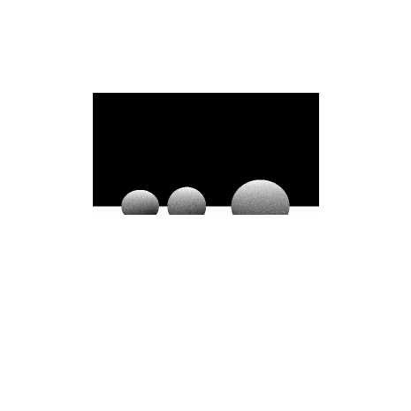

# [Ambient Occlusion Rendering](http://wonderfl.net/c/7W2s)

favorite:17 / forked:9

Ambient Occlusion Bench Flash10 porting  
Original version of AO bench was written by Syoyo Fujita.  
http://lucille.atso-net.jp/aobench/  
In original Flash10 porting, it takes 7 times slower than the Proce55ing.  
(refer from http://lucille.atso-net.jp/blog/?p=638).  
And now, it seems to be same speed as the Proce55ing does.  
 ----------------------------------------------------------------------  
webpage; http://soundimpulse.sakura.ne.jp/ambient-occlusion-rendering/

