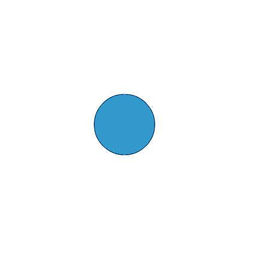

# [クラリネットメソッド](http://wonderfl.net/c/bHp5)

favorite:7 / forked:3

--------------------------------------------------  
ドが壊れれば，レとミとファとソとラとシも壊れるものです．  
【壊れ物リスト】  
- Number, Math 一式  
- var  
- 代入演算  
- 乗算, 除算  
- 比較演算  
- ループ関数  
webpage; http://soundimpulse.sakura.ne.jp/clarinet-method/

