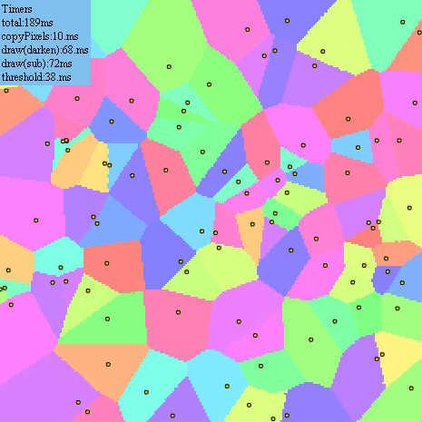

# [draw() と threshold() を用いたボロノイ図の生成の高速化(と新editorお試し)](http://wonderfl.net/c/fqub)

favorite:18 / forked:2

100点 x 4倍精度  
ボトルネック解析（Fork元参照）の結果から  
copyChannel -> copyPixels  
draw(difference) -> draw(subtract)  
にして約2倍高速化．

