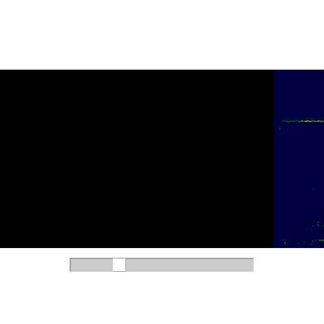

# [Simple spectrum analyzer (SiON FFT module + FP10.1 microphone)](http://wonderfl.net/c/bxCT)

favorite:18 / forked:15

SiON FFT module で 声紋解析 (Hamming窓＋時間分解能11ms)  
webpage; http://soundimpulse.sakura.ne.jp/simple-spectrum-analyzer/

