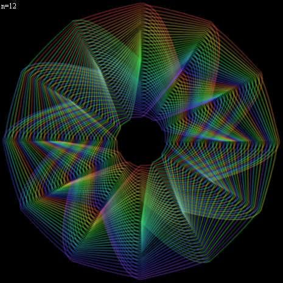

# [forked from: Perfect Shuffle Visualization](http://fl.corge.net/c/dVwy)

favorite:27 / forked:2

 ------------------------------------------------------  
Perfect Shuffle Visualization  
 ------------------------------------------------------  
How many times does it requires for 15 cards to   
go back to where one started?  
inspired by:  
http://d.hatena.ne.jp/nishiohirokazu/20100107/1262835414  
 ------------------------------------------------------------  
The Perfect Shuffle resets order when ...  
cards = (1<<(n>>1))-((n&1)<<1);  
steps = (n&~1)>>(n&1);  
Press left or right arrow to change the n value.  
 ------------------------------------------------------------  
webpage; http://soundimpulse.sakura.ne.jp/perfect-shuffle/

