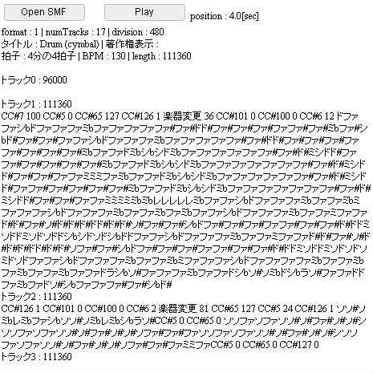

# [MIDIシーケンスを演奏してみた](http://wonderfl.net/c/eZnB)

favorite:33 / forked:6

デフォルトのMIDIは，kashiwa@正直日記さんのものをお借りしました．  
最初に，ドラムをプリレンダリングするため，少し待ってください．  
ほんのちょっと複雑なMIDIファイルを鳴らすだけで，  
誰でも簡単にブラウザクラッシュができます．  
  
SiON v0.652よりMIDI再生機能として搭載されました。http://soundimpulse.sakura.ne.jp/sion-midi-player/  
webpage; http://soundimpulse.sakura.ne.jp/play-midi-on-wonderfl/

