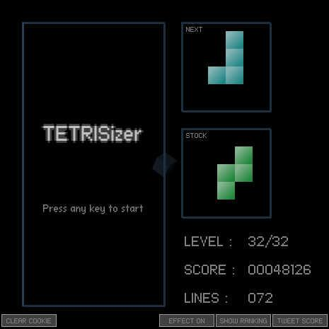

# [SiON TETRISizer](http://fl.corge.net/c/f5eX)

favorite:155 / forked:37

 --------------------------------------------------------------------------------   
TETRISiON ～ もし水口哲也がテトリスを作ったら  
 --------------------------------------------------------------------------------   
< controls >  
move;[Left]-[Right]/  drop;[Down]/  hard-drop;[Up]/  L-turn;[Z]/  R-turn;[X]  
swap;[C] = Swap current block and stocked block.  
< special rules >  
1) The level increases by 1 erasing.  
2) The game is finished at level 32.  
3) The field has only 8 rows.  
4) You can erase lines with "chain combo".  
5) You can stock 1 block and swap it wherever.  
6) The bonus is doubled over level 24.  
7) [bonus] = ([erased line count]^2 + [chain combo count]^2) * 100  
< notice >  
This flash uses cookie to keep hi-score.  
If you do not want, please press "CLEAR COOKIE" button.  
 --------------------------------------------------------------------------------   
webpage; http://soundimpulse.sakura.ne.jp/sion-tetrisizer/

