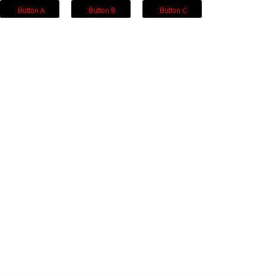

# [forked from: カオスバージョン forked from: あなたのイベントハンドラを教えて！](http://fl.corge.net/c/ttp8)

favorite:14 / forked:0

あなたのイベントハンドラを教えて！  
*  
* 複数のイベント＆複数のインスタンスに  
* イベントハンドラを設定するときに  
* みなさんの記述方法の違いを知りたい。  
*  
* [ルール]  
* 画面上に3つのボタンが用意されており、  
* クリックとロールオーバーの  
* イベントハンドラを記述してください。  

