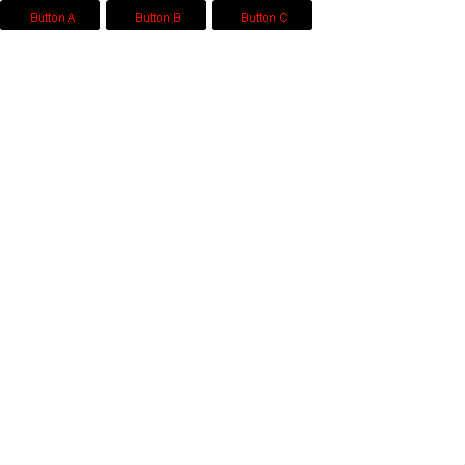

# [手打ち圧縮 ff: カオス ff: あなたのイベントハンドラを教えて！](http://wonderfl.net/c/2GzS)

favorite:6 / forked:0

あなたのイベントハンドラを教えて！  
*  
* 複数のイベント＆複数のインスタンスに  
* イベントハンドラを設定するときに  
* みなさんの記述方法の違いを知りたい。  
*  
* [ルール]  
* 画面上に3つのボタンが用意されており、  
* クリックとロールオーバーの  
* イベントハンドラを記述してください。  
*--------------------------------------------------  
* Please tell us your event handler !!  
* We would like to know how to set event handlers to plural events and instances.  
* (Pleass refer the forked root code by clockmaker for basic sample.)  
*  
* [RULES]  
* Please put 3 buttons on the screen,   
* and write your code to handle "click" and "rollover" event.  

