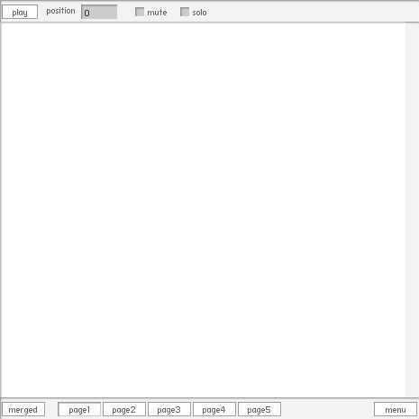

# [SiON MML Edtor 2 ](http://wonderfl.net/c/yMPL)

favorite:27 / forked:3

SiON MML Editor  
[USAGE]   
Write MML in the text field and Shift+Enter to play.  
All MMLs in all pages are concatenated and play.  
Ctrl+Z to undo, Ctrl+Y to redo (codes from psyark's Psycode)  
 ------------------------------------------------------------  
webpage; http://soundimpulse.sakura.ne.jp/sion-mml-edtor-2/

