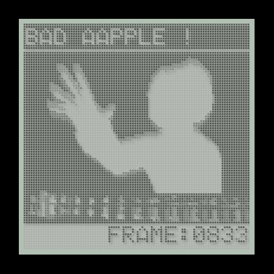

# [Movie data in one PNG image](http://wonderfl.net/c/dfMj)

favorite:115 / forked:9

Extremely compressed movie data and sound data in one png image.  
The MML Data is modification of Bad Apple!! feat. nomico [ 16bit C-S-Mix ] by kashiwa http://mmltalks.appspot.com/m/TYMtn  
The original SEGA Genesis arrange is inspired from http://www.youtube.com/watch?v=lbAxuFgQyHQ&feature=youtu.be  
And the binary data for SEGA Genesis here  http://68000.web.fc2.com/bad_apple.html  
【東方】Bad Apple!!　ＰＶ【影絵】http://www.nicovideo.jp/watch/sm8628149 http://www.youtube.com/watch?v=FtutLA63Cp8  
【第5回MMD杯本選】 Bad AApple!! http://www.nicovideo.jp/watch/sm11820316 http://www.youtube.com/watch?v=BF_P--N4ozg  
LCD Rendering http://wonderfl.net/c/7lZE  
blog; 技術的解説 http://d.hatena.ne.jp/keim_at_Si/20110404/p1  
webpage; http://soundimpulse.sakura.ne.jp/movie-data-in-one-png-image/

