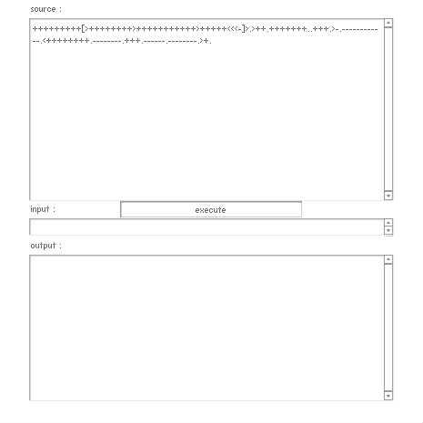

# [BrainF*ck interpreter challenge](http://wonderfl.net/c/49Vu)

favorite:7 / forked:5

Shoten this BrainF*ck interpreter (currently in 262 letters.)  
  
[Description for basic code]  
http://wonderfl.net/c/uyUc (by nitoyon)  
  
[Verification code]  
- source : +++++[>+++++++++<-],[[>--.++>+<<-]>+.->[<.>-]<<,]  
- input  : Hello world !  
- output : (BrainF*ck code for "Hello world !")  
from http://brainfuck.sourceforge.net/results0.html  
  
[This rule]  
- source : char[] (restricted. null terminated)  
- input  : char[] (null terminated ascii)  
- output : char[] (ascii only)  
- You have to stop execution when the input string achieves to the end.  
http://wonderfl.net/c/cXpH (242 letters by bkzen)  
http://wonderfl.net/c/u2Ll (212 letters by h013)  
http://wonderfl.net/c/tfas (198 letters by shohei909)  
http://wonderfl.net/c/2zxh (192 letters by keim_at_Si)  
http://wonderfl.net/c/tSH9 (188 letters by h013)  
http://wonderfl.net/c/nTie (183 letters by shohei909)   
  
webpage; http://soundimpulse.sakura.ne.jp/brainfck-interpreter-challenge/

