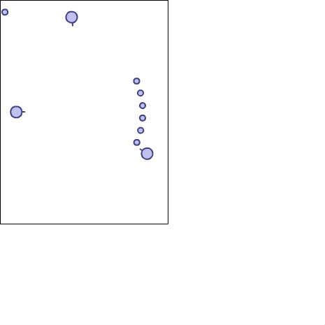

# [How to use CannonML ?](http://fl.corge.net/c/khgM)

favorite:4 / forked:4

CannonML の基本的な使用法です。CMLObjectの継承クラスで敵や弾を作成することでCannonML script で動作するオブジェクトを作成することができます。  
CannonML: http://www.libspark.org/wiki/keim/cannonML  

