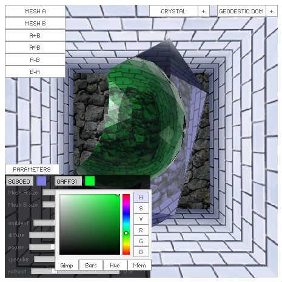

# [Boolean Crystal](http://wonderfl.net/c/vpLs)

favorite:66 / forked:10

Constructive solid geometry with refraction rendering (cube mapping).  
blog; ブーリアン演算の技術解説：http://d.hatena.ne.jp/keim_at_Si/20111122/p1  
webpage; http://soundimpulse.sakura.ne.jp/boolean-crystal/

