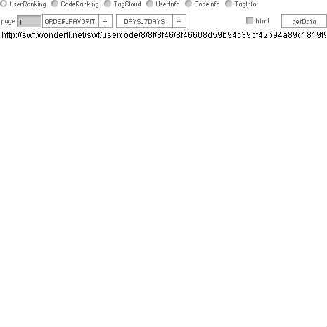

# [YAWA - Yet Another Wonderfl API v0.16 (SWF素材)](http://fl.corge.net/c/krt3)

favorite:22 / forked:3

You can get more informations than official API !  
The basic idea is from http://fl.corge.net/c/gJXA (created by wh0)  
かなり縦横無尽に情報が取れる wonderflAPI．運営様に怒られたら消します．htmlの書式が変わったら使えなくなります．  
  
// basic functions  
requestUserRanking(responseHandler, days, order, page);  
requestCodeRanking(responseHandler, days, order, page);  
requestTagCloud(responseHandler);  
requestUserInfo(responseHandler, userID, informationType, page);  
requestCodeInfo(responseHandler, codeID, order(N/A), page);  
requestTagInfo(responseHandler, tag, page);  
(where responseHandeler(data:*) : void {})  
// analyze imported libraries  
analyzeLibraries(as3code) : *  
webpage; http://soundimpulse.sakura.ne.jp/yawa-yet-another-wonderfl-api/

