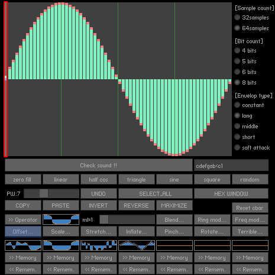

# [Wave Shape Editor](http://wonderfl.net/c/lgUJ)

favorite:25 / forked:3

Functional wave shape editor for wave table synthesizer chip emulators.  
blog (English); http://en.wikipedia.org/wiki/Konami_SCC  
blog (Japanese); http://ja.wikipedia.org/wiki/%E6%B3%A2%E5%BD%A2%E3%83%A1%E3%83%A2%E3%83%AA%E9%9F%B3%E6%BA%90  
webpage; http://soundimpulse.sakura.ne.jp/wave-shape-editor/  
  
Operation Manual  
English:https://sites.google.com/site/sioncenter/example/wave-shape-editor/wave-shape-editor-operation-manual  
Japanese:https://sites.google.com/site/sioncenterj/examples/wave-shape-editor/wave-shape-editor-operation-manual

