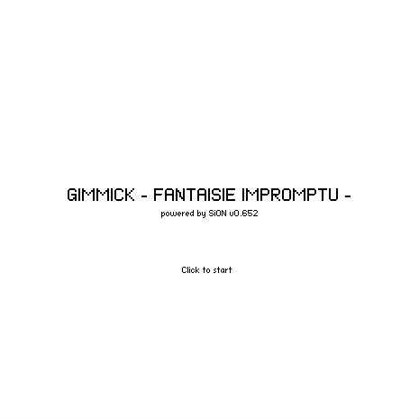

# [GIMMICK - FANTAISIE IMPROMPTU -](http://fl.corge.net/c/myhA)

favorite:81 / forked:11

All MIDI data are from http://www5b.biglobe.ne.jp/~hasekou/midi.htm (All rights reserved by HSK)  
Demonstration for MIDI and PCM module of SiON v0.65   
Mouse drag to move camera.  
blog; MIDIデータきのこる先生：http://d.hatena.ne.jp/keim_at_Si/20120903/p1  
webpage; http://soundimpulse.sakura.ne.jp/gimmick-fantaisie-impromptu/

